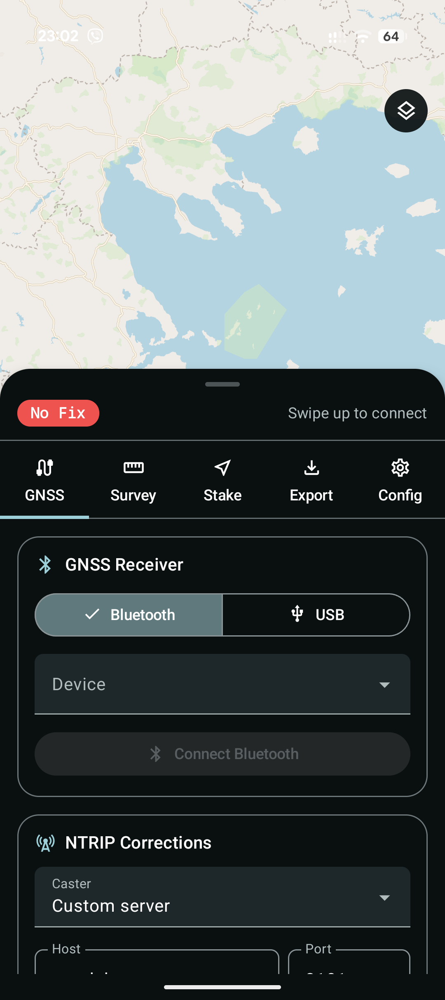
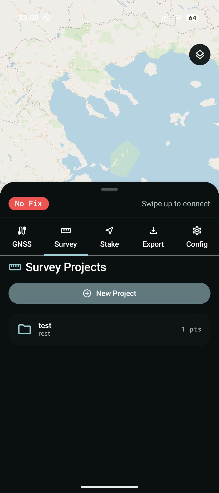
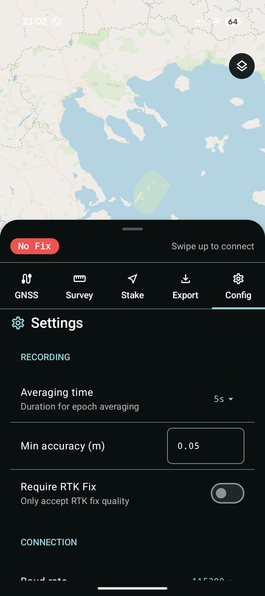

<p align="center">
  
</p>

<h1 align="center">OpenTopo</h1>

<p align="center"><strong>Open-source Android GNSS survey app with HEPOS/GGRS87 grid transformation for Greece.</strong></p>

[](https://github.com/ppapadeas/opentopo/actions/workflows/ci.yml)
[](https://github.com/ppapadeas/opentopo/actions/workflows/release.yml)
[](LICENSE)
[](https://developer.android.com/about/versions/oreo)

---

## Download

<a href="https://play.google.com/store/apps/details?id=org.opentopo.app"></a>

Also available from [GitHub Releases](https://github.com/ppapadeas/opentopo/releases) and the [self-hosted F-Droid repo](https://ppapadeas.github.io/opentopo/fdroid/repo).

## Why OpenTopo?

Greek surveyors and engineers using low-cost RTK GNSS receivers (ArduSimple, u-blox ZED-F9P, Emlid) on Android have no open-source app that correctly transforms WGS84/ETRS89 coordinates to GGRS87/EGSA87 (EPSG:2100). The transformation requires a 7-parameter Helmert datum shift **plus** a 2D correction grid published by Ktimatologio S.A. Without the grid, errors of 0.5-2.0 m make results unusable for cadastral and engineering work.

OpenTopo solves this by implementing the full HEPOS transformation model and packaging it in a free, open-source survey data collector.

## Screenshots

<p align="center">
  
  
  
  
  
</p>

## Features

### HEPOS Transformation Engine
Full 6-step pipeline: geographic-to-Cartesian, 7-parameter Helmert, Cartesian-to-geographic, Transverse Mercator projection, grid interpolation, correction application. Sub-centimetre accuracy validated against 10 reference points across Greece.

### GNSS Connections
- **Bluetooth Classic (SPP)** -- connect to any NMEA-compatible receiver
- **USB-OTG serial** -- via SerialInputOutputManager (usb-serial-for-android)
- **Internal GPS** -- Android LocationManager NMEA for quick field checks
- Parses GGA, RMC, GSA, GSV, GST sentences with multi-constellation support (GPS, GLONASS, Galileo, BeiDou)
- Auto-reconnect on startup for all connection types

### NTRIP Client
- Raw TCP socket client with NTRIP v1 (ICY 200 OK) support
- VRS/GGA forwarding with synthetic GGA generation
- Presets for HEPOS (Ktimatologio), CivilPOS, Hexagon SmartNet Greece, plus custom server option
- Auto-reconnect on startup
- RTCM corrections routed to whichever transport (BT/USB) is active

### Map
- Vathra.xyz Protomaps vector tiles (OpenStreetMap data, Greek labels)
- Ktimatologio orthophoto WMS overlay
- Contour lines overlay (vathra.xyz)
- Survey points displayed with fix-quality colors and labels
- User position dot colored by fix quality
- Layer switcher (Street Map / Orthophoto / Contours)

### Survey Data Collection
- Create projects, record points with configurable epoch averaging (1-60 s)
- **Quick Mark** — single-epoch instant capture for waypoints
- **Line recording** — tap vertices, compute cumulative distance
- **Polygon recording** — close to polygon, compute area (m², Shoelace formula on EGSA87)
- Point/Line/Area mode switcher with context-sensitive recording
- Quality filters: minimum accuracy threshold, RTK-only mode
- Point edit and delete with confirmation dialogs
- Photo attachments on recorded points
- Haptic and audio feedback on point recorded

### Stakeout Navigation
Navigate to target EGSA87 coordinates with live compass, distance, bearing, and delta E/N display. Immersive full-screen mode with dark background, extra-large distance readout, 240 dp compass, and fix status pill for heads-up field navigation.

### Geoid & Height Support
- Orthometric height (H = h - N) from receiver-reported geoid separation
- Dual height display in status bar (ellipsoidal and MSL)
- Geoid fields exported in all formats (CSV, GeoJSON, DXF, Shapefile)

### Coordinate Tools
- Interactive coordinate converter (WGS84 to EGSA87) with full pipeline visualization
- Transform parameter inspector showing Helmert parameters, TM constants, and grid metadata
- Geoid undulation inspector step in pipeline

### Export and Import
- Export CSV (both WGS84 and EGSA87), GeoJSON (EPSG:2100), DXF (AutoCAD R12), Shapefile (SHP/DBF/SHX/PRJ ZIP)
- CSV import for bringing in external point data, CSV stakeout target import
- Android share intent for all export formats

### Trigonometric Point Integration
25,259 Greek GYS trig points from vathra.xyz API displayed as status-colored markers on the map. Tap for details (name, EGSA87 coordinates, elevation, status). "Nearby Trig Points" in stakeout for quick target selection.

### Satellite Skyplot
Polar chart showing tracked satellites with constellation colors and elevation/azimuth positioning.

### Settings
- Recording: averaging time, minimum accuracy, RTK-only requirement
- Connection: baud rate, GGA forwarding interval
- Display: coordinate format
- All settings persisted via DataStore

### UI
- Material 3 Expressive visual overhaul (MaterialExpressiveTheme, MotionScheme.expressive)
- M3E ShortNavigationBar: GNSS, Survey, Stakeout, Tools (4 tabs with pill indicators)
- M3E ButtonGroup with connected ToggleButtons for mode selection
- Emphasized typography variants, M3E-spec shapes (4/8/12/16/28dp)
- AMOLED dark mode for field battery conservation
- Record button pulse ring animation during point recording
- FAB always visible (dimmed when disabled)
- Active layer indicators in map layer switcher
- Persistent fix status pill on map
- NTRIP disconnect alert vibration
- Map-centric design with full-screen MapLibre and bottom sheet tool panels

## Architecture

```
opentopo/
├── lib-transform/          Pure Kotlin/JVM library (no Android deps)
│   └── org.opentopo.transform
│       ├── Coordinates     Data classes for geographic/projected coords
│       ├── Ellipsoid       GRS80 constants, XYZ <-> geographic
│       ├── Helmert         7-parameter similarity transform
│       ├── TransverseMercator  Forward TM projection
│       ├── CorrectionGrid  Grid parser + bilinear interpolation
│       └── HeposTransform  Full pipeline orchestrator
│
└── app/                    Android application
    └── org.opentopo.app
        ├── gnss/           NmeaParser, BluetoothGnssService, UsbGnssService,
        │                   InternalGnssService, GnssState
        ├── ntrip/          NtripClient (raw TCP), NtripConfig
        ├── survey/         SurveyManager, Stakeout
        ├── export/         CsvExporter, CsvImporter, GeoJsonExporter, DxfExporter
        ├── prefs/          UserPreferences (DataStore)
        ├── db/             Room database (Projects, Points)
        └── ui/             Jetpack Compose
            ├── MainMapScreen   Map-centric layout with BottomSheetScaffold
            ├── ConnectionPanel, SurveyPanel, StakeoutPanel, ExportPanel
            ├── TransformPanel  Coordinate converter + pipeline inspector
            ├── SettingsPanel   App configuration
            ├── StakeoutImmersiveOverlay  Full-screen dark stakeout HUD
            ├── Skyplot         Satellite polar chart
            └── theme/          M3 Expressive theme, colors, typography
```

The transformation engine (`lib-transform`) is a pure Kotlin/JVM library with zero Android dependencies. It can be unit-tested on JVM, reused server-side, or published as a standalone library for Greek coordinate transformations.

## Build

**Prerequisites:** JDK 17+, Android SDK with compileSdk 36 (AGP 9.1.0, Gradle 9.4.1).

```bash
git clone https://github.com/ppapadeas/opentopo.git
cd opentopo

# Run transformation tests (no device needed)
./gradlew :lib-transform:test

# Run all unit tests
./gradlew :lib-transform:test :app:testDebugUnitTest

# Build debug APK
./gradlew assembleDebug

# Install on connected device
adb install app/build/outputs/apk/debug/app-debug.apk
```

## Test Vectors

The transformation engine is validated against 10 points across Greece with sub-centimetre tolerance:

| Location | Latitude | Longitude | Expected E (EGSA87) | Expected N (EGSA87) |
|----------|----------|-----------|---------------------|---------------------|
| Athens | 37.9715 | 23.7267 | 475846.417 | 4202401.145 |
| Thessaloniki | 40.6401 | 22.9444 | 410590.254 | 4499055.448 |
| Kalamata | 37.0388 | 22.1143 | 332145.258 | 4100551.548 |
| Heraklion | 35.3387 | 25.1442 | 603830.795 | 3910917.558 |
| Corfu | 39.6243 | 19.9217 | 149769.169 | 4393724.733 |
| Rhodes | 36.4341 | 28.2176 | 877980.791 | 4040083.307 |

## CI/CD

- **CI** runs on every push to `main` and pull request: tests, lint, debug APK
- **Release** triggers on `v*` tag push: tests, signed release APK + AAB, Google Play upload, GitHub Release

```bash
# Create a release
git tag v1.9.0
git push origin v1.9.0
# -> Tests run, signed AAB uploaded to Google Play, GitHub Release created
```

## Contributing

See [CONTRIBUTING.md](CONTRIBUTING.md) for development setup, coding conventions, and PR guidelines.

## License

OpenTopo is licensed under the [GNU Affero General Public License v3.0](LICENSE).

The HEPOS correction grids (`dE_2km_V1-0.grd`, `dN_2km_V1-0.grd`) are published by Ktimatologio S.A. for use by equipment manufacturers and surveyors.

## Privacy

OpenTopo does not collect, transmit, or store any personal data beyond what you explicitly save in survey projects on your device. See [PRIVACY_POLICY.md](PRIVACY_POLICY.md).
